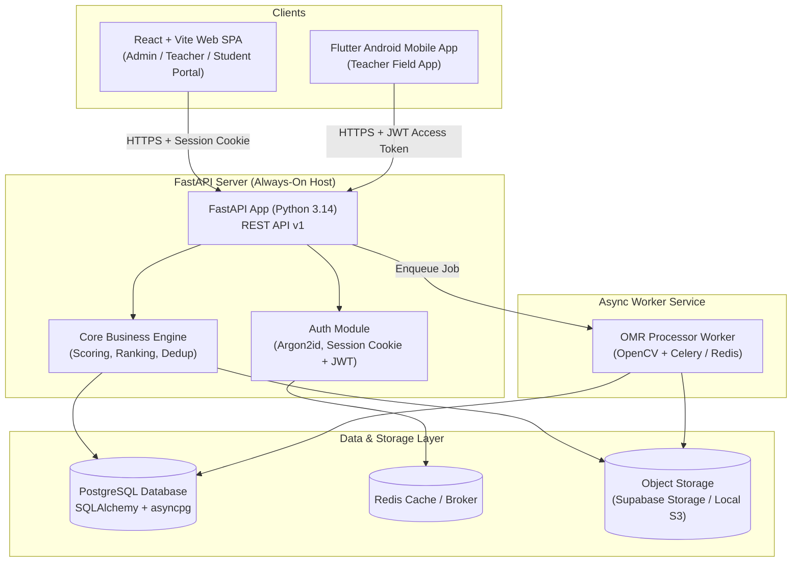
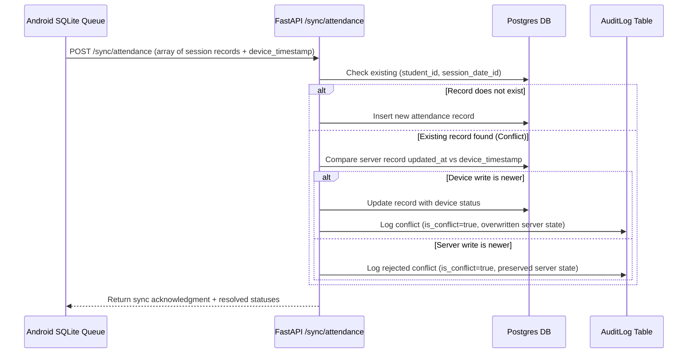

# JMO Management System — Architecture & API Specification

> System architecture and REST API design.
> Source of truth: [context.md](context.md) | Divergence Log: [audit-notes.md](audit-notes.md)

---

## 1. System Architecture Overview



### 1.1 Architectural Rationale

1. **FastAPI Always-On Process**: Selected over serverless functions to accommodate async OMR OpenCV image processing, persistent connection pooling, task queues, and structured audit event streaming.
2. **React + Vite Web SPA**: Deployed to static hosting for fast CDN asset delivery, hosting the Admin, Teacher, and Student web portals.
3. **Flutter Android Field App**: Mobile application optimized for offline attendance recording, score entry, and OMR camera capture.
4. **PostgreSQL & Redis**: PostgreSQL acts as the ACID-compliant primary data store. Redis handles rate limiting, session caching, and background job queuing.

---

## 2. Directory Layout & Monorepo Structure

```
jmox/
├── apps/
│   ├── web/                          # React + Vite SPA (TypeScript)
│   │   ├── src/
│   │   │   ├── api/                  # Axios HTTP client, API interfaces
│   │   │   ├── components/           # UI components (Button, Modal, Table...)
│   │   │   ├── features/             # Domain modules (students, attendance, olympiads)
│   │   │   ├── hooks/                # Custom React hooks
│   │   │   ├── layouts/              # App Shell, Navigation Layouts
│   │   │   ├── pages/                # Route components (Dashboard, Results, Login)
│   │   │   └── stores/               # Zustand global state stores
│   │   └── package.json
│   │
│   └── android/                      # Flutter Mobile Application
│       ├── lib/
│       │   ├── api/                  # API client & JSON serialization
│       │   ├── models/               # Dart data models
│       │   ├── screens/              # Flutter screen widgets
│       │   ├── services/             # Local database (SQLite) & sync service
│       │   └── main.dart
│       └── pubspec.yaml
│
├── server/                           # FastAPI Backend Service
│   ├── app/
│   │   ├── api/v1/
│   │   │   ├── routes/               # API endpoint modules
│   │   │   │   ├── auth.py
│   │   │   │   ├── students.py
│   │   │   │   ├── teachers.py
│   │   │   │   ├── academic.py
│   │   │   │   ├── attendance.py
│   │   │   │   ├── olympiads.py
│   │   │   │   ├── papers.py
│   │   │   │   ├── omr.py
│   │   │   │   ├── results.py
│   │   │   │   └── audit_logs.py
│   │   │   ├── dependencies.py       # DB session, Auth dependencies
│   │   │   └── router.py             # Router aggregator
│   │   ├── core/                     # Framework-agnostic business logic
│   │   │   ├── scoring.py            # Scoring & negative marking rules
│   │   │   ├── ranking.py            # Section tie-breaking algorithm
│   │   │   └── attendance.py         # Dedup & conflict resolution
│   │   ├── models/                   # SQLAlchemy ORM models
│   │   ├── schemas/                  # Pydantic validation schemas
│   │   ├── workers/                  # OMR processing worker
│   │   └── main.py                   # FastAPI application initialization
│   ├── alembic/                      # Database migrations
│   └── requirements.txt
├── docs/                             # Architecture & specification docs
└── run.sh                            # One-click environment launcher
```

---

## 3. Client Architecture

### 3.1 Web SPA (React + TypeScript)
- **State Management**: Zustand for global user session and UI preferences; React Query (TanStack Query) for server state caching.
- **HTTP Client**: Axios instance configured with base URL `/api/v1`, `withCredentials: true` for HTTP-only session cookies, and automatic CSRF header injection.
- **Authentication Flow**: Supports Web login for Admins, Teachers, and Students. Stores user role, public ID, and profile metadata.

### 3.2 Mobile App (Flutter Android)
- **Local Persistence**: SQLite database (`sqflite`) for caching student rosters, active batch schedules, and un-synced attendance session logs.
- **Auth Storage**: `flutter_secure_storage` for keeping JWT access tokens and long-lived refresh tokens.
- **Sync Engine**: Idempotent background sync engine uploading queued attendance batches to `POST /api/v1/sync/attendance`.

---

## 4. API Specification & Endpoints

All API endpoints reside under the `/api/v1` prefix and return standard JSON payloads.

### 4.1 Standard Response Envelope Format

```json
{
  "status": "success",
  "data": {},
  "message": "Operation completed successfully.",
  "meta": {
    "timestamp": "2026-09-19T21:58:00Z",
    "request_id": "req-98124"
  }
}
```

#### Status Vocabulary
- `success`: Request completed successfully (HTTP 200, 201).
- `validation_error`: Invalid inputs or request payload schema mismatch (HTTP 422).
- `unauthorized`: Missing or expired auth credentials (HTTP 401).
- `forbidden`: Insufficient role privileges (HTTP 403).
- `conflict`: Resource state conflict or concurrent sync collision (HTTP 409).
- `server_error`: Unhandled exception on backend (HTTP 500).

---

### 4.2 Endpoint Reference Table

| Category | Method | Endpoint Path | Description | Access Role |
|----------|--------|---------------|-------------|-------------|
| **Auth** | `POST` | `/api/v1/auth/login` | Log in with email/username & password | Public |
| **Auth** | `POST` | `/api/v1/auth/logout` | Clear session cookie / revoke refresh token | Authenticated |
| **Auth** | `GET`  | `/api/v1/auth/me` | Fetch active user profile and permissions | Authenticated |
| **Auth** | `POST` | `/api/v1/auth/password-reset` | Trigger password reset email / update | Authenticated |
| **Students** | `GET`  | `/api/v1/students` | List students (filterable by class, batch, status) | Admin, Teacher |
| **Students** | `POST` | `/api/v1/students` | Create student (auto-generates `public_id` & login credentials) | Admin |
| **Students** | `GET`  | `/api/v1/students/{id}` | Get student detail, enrollment history & stats | Admin, Teacher, Student |
| **Students** | `POST` | `/api/v1/students/{id}/credentials` | Generate/reset student login password | Admin |
| **Students** | `POST` | `/api/v1/students/import` | Bulk import students via CSV/Excel | Admin |
| **Teachers** | `GET`  | `/api/v1/teachers` | List teacher directory | Admin |
| **Teachers** | `POST` | `/api/v1/teachers` | Add teacher (auto-generates login password/invite) | Admin |
| **Teachers** | `POST` | `/api/v1/teachers/{id}/credentials` | Re-generate teacher login password | Admin |
| **Academic** | `GET`  | `/api/v1/classes` | List academic classes | All |
| **Academic** | `GET`  | `/api/v1/batches` | List batches (filtered by teacher or class) | All |
| **Academic** | `GET`  | `/api/v1/subjects` | List academic subjects | All |
| **Attendance** | `GET`  | `/api/v1/attendance/sessions` | Fetch scheduled attendance sessions | Admin, Teacher |
| **Attendance** | `POST` | `/api/v1/attendance/mark` | Record attendance for a session | Teacher, Admin |
| **Attendance** | `POST` | `/api/v1/sync/attendance` | Idempotent offline attendance sync batch | Teacher |
| **Olympiads** | `GET`  | `/api/v1/olympiads` | List olympiad events | All |
| **Olympiads** | `POST` | `/api/v1/olympiads` | Create new olympiad assessment | Admin |
| **Papers** | `GET`  | `/api/v1/papers/{id}` | Fetch paper structure, sections, questions | Admin, Teacher |
| **Papers** | `POST` | `/api/v1/papers/{id}/lock` | Lock paper and answer key version | Admin |
| **OMR** | `POST` | `/api/v1/omr/upload` | Upload scanned OMR sheet image for processing | Admin, Teacher |
| **OMR** | `GET`  | `/api/v1/omr/submissions` | List OMR submissions & review status | Admin, Teacher |
| **OMR** | `POST` | `/api/v1/omr/verify` | Confirm / override OMR bubble readings | Admin, Teacher |
| **Results** | `POST` | `/api/v1/results/evaluate` | Trigger automated scoring & rank calculation | Admin |
| **Results** | `POST` | `/api/v1/results/publish` | Publish results & freeze snapshot | Admin |
| **Results** | `GET`  | `/api/v1/results/rankings` | Fetch leaderboard and rank cards | All |
| **Materials** | `GET`  | `/api/v1/materials` | List learning notes and worksheets | All |
| **Books** | `GET`  | `/api/v1/books` | List recommended reading list | All |
| **Notifications** | `GET`  | `/api/v1/notifications` | Fetch user notification feed | Authenticated |
| **Audit Logs** | `GET`  | `/api/v1/audit-logs` | Query system audit trail & sync conflicts | Admin |

---

## 5. Offline Sync Engine (Android Field App)



---

## 6. Document Cross-References

- PRD & Feature Specs: [requirements.md](requirements.md)
- Architecture Divergences: [audit-notes.md](audit-notes.md)
- Complete Database Schema: [database-design.md](database-design.md)
- Design System & UI Guidelines: [ui-ux-design.md](ui-ux-design.md)
- Deployment & Security: [security-testing-deployment.md](security-testing-deployment.md)
