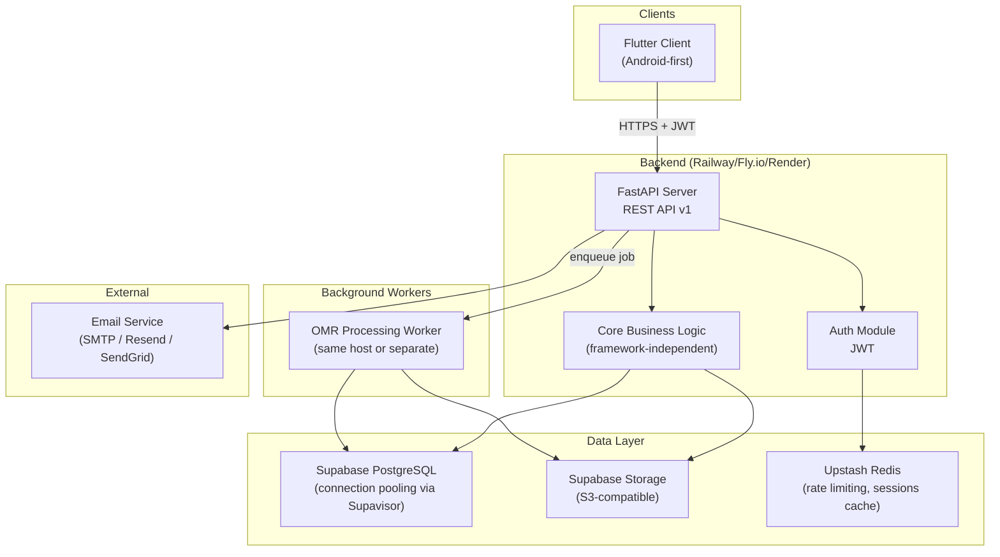
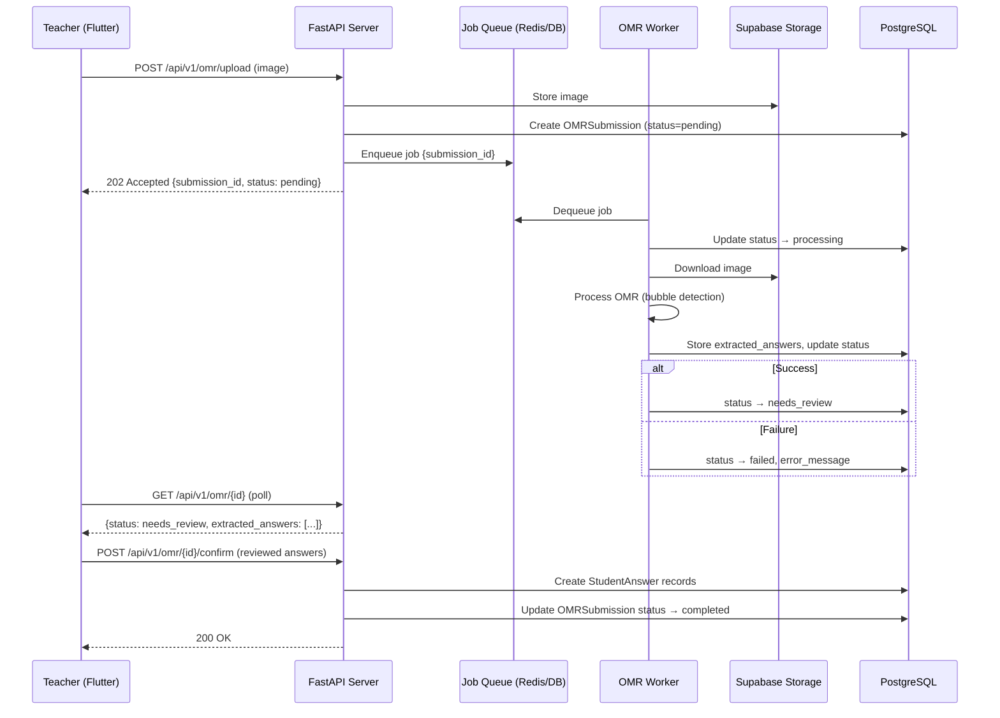

# JMO Management System — Architecture & API Specification

> System architecture and REST API design.
> Derived from: [requirements.md](requirements.md) · [database-design.md](database-design.md) · [context.md](context.md)

---

## 1. System Architecture

### 1.1 Architecture Diagram



### 1.2 Key Architecture Decisions

| Decision | Rationale |
|----------|-----------|
| **FastAPI on always-on host** | OMR processing, connection pooling, background jobs, and WebSocket potential all require a persistent process. |
| **Flutter client** | One typed, adaptive client for the v1 Android release, with platform services isolated so future Flutter targets do not require an API redesign. |
| **Supabase for DB + Storage** | Managed Postgres with built-in connection pooling (Supavisor), row-level security capability, S3-compatible storage. Resolves audit item #17. |
| **Core logic is framework-independent** | Business rules (scoring, ranking, attendance dedup) live in a pure Python `core/` package with no FastAPI dependencies. Can be tested without HTTP. |
| **OMR as async worker** | Image processing is CPU-intensive and unpredictable in duration. Decoupled via a job queue (Redis/DB-backed). Resolves audit item #16. |

---

## 2. Monorepo Structure

```
jmox/
├── apps/
│   ├── android/                      # Flutter client (Android-first)
│       ├── lib/
│       │   ├── api/                  # API client
│       │   ├── models/               # Data models
│       │   ├── screens/              # Screen widgets
│       │   ├── widgets/              # Reusable widgets
│       │   ├── services/             # Auth, offline sync, device services
│       │   ├── providers/            # State management
│       │   └── main.dart
│       └── pubspec.yaml
│
├── server/                           # FastAPI backend
│   ├── app/
│   │   ├── api/
│   │   │   └── v1/
│   │   │       ├── routes/           # Route handlers per resource
│   │   │       ├── dependencies.py   # FastAPI dependencies (auth, db session)
│   │   │       └── router.py         # Aggregated v1 router
│   │   ├── core/                     # Framework-independent business logic
│   │   │   ├── scoring.py            # Score calculation, negative marking
│   │   │   ├── ranking.py            # Ranking algorithm, tie-breaking
│   │   │   ├── attendance.py         # Dedup, conflict resolution
│   │   │   ├── results.py            # Result lifecycle, snapshotting
│   │   │   └── permissions.py        # Role-based authorization rules
│   │   ├── models/                   # SQLAlchemy ORM models
│   │   ├── schemas/                  # Pydantic request/response schemas
│   │   ├── services/                 # Application services (orchestration)
│   │   ├── auth/                     # JWT authentication and token lifecycle
│   │   ├── workers/                  # Background job definitions
│   │   │   └── omr_processor.py
│   │   ├── db/
│   │   │   ├── session.py            # Database session management
│   │   │   └── migrations/           # Alembic migrations
│   │   ├── config.py                 # Settings from env vars
│   │   └── main.py                   # FastAPI app factory
│   ├── tests/
│   │   ├── unit/                     # Core logic tests
│   │   ├── integration/              # API endpoint tests
│   │   └── conftest.py               # Test fixtures
│   ├── alembic.ini
│   └── requirements.txt
│
├── docs/                             # This documentation
├── .env.example
├── docker-compose.yml                # Local dev: Postgres, Redis
└── README.md
```

---

## 3. Flutter Client Architecture

### 3.1 Tech Stack

| Layer              | Technology                                         |
|--------------------|----------------------------------------------------|
| Framework          | Flutter 3.16+                                      |
| Language           | Dart 3+                                             |
| Navigation         | Flutter Navigator with named route/feature guards  |
| State management   | Provider (current project convention)              |
| HTTP client        | `http` with authenticated request service           |
| Secure storage     | `flutter_secure_storage`                            |
| Offline storage    | SQLite via `sqflite`                                |
| Device services    | `camera`, `image_picker`, connectivity-aware sync   |
| Testing            | `flutter_test` and integration tests                |

### 3.2 API Client Pattern

```dart
// lib/api/api_client.dart
final response = await apiClient.get(
  '/students',
  headers: {'Authorization': 'Bearer $accessToken'},
);
```

The API client owns base URL configuration, JSON decoding, timeout handling, token refresh, and normalized error mapping. Screens and widgets must not construct raw URLs or implement authorization rules.

---

## 4. Backend Architecture (FastAPI)

### 4.1 Tech Stack

| Layer              | Technology                                         |
|--------------------|----------------------------------------------------|
| Framework          | FastAPI                                            |
| Language           | Python 3.11+                                       |
| ORM                | SQLAlchemy 2.0 (async)                             |
| Migrations         | Alembic                                            |
| Validation         | Pydantic v2                                        |
| Auth               | PyJWT + passlib (argon2)                           |
| Task queue         | ARQ (Redis-backed) or DB-backed job table          |
| Testing            | pytest + httpx (async)                             |

### 4.2 Core Business Logic Separation

The `server/app/core/` package contains **pure Python** functions with no FastAPI, SQLAlchemy, or HTTP dependencies. This ensures:

- Business rules are independently testable
- Logic can be reused (e.g., in a CLI tool or migration script)
- No accidental coupling to the HTTP framework

```python
# core/scoring.py — example
def calculate_score(
    answers: list[StudentAnswerData],
    answer_key: dict[str, str],
    questions: dict[str, QuestionConfig],
) -> ScoreResult:
    """Pure function: answers + key + config → score. No DB, no HTTP."""
    correct = incorrect = unanswered = 0
    total_score = 0

    for answer in answers:
        q = questions[answer.question_id]
        if answer.selected_option is None:
            unanswered += 1
        elif answer.selected_option == answer_key[answer.question_id]:
            correct += 1
            total_score += q.marks
        else:
            incorrect += 1
            total_score -= q.negative_marks

    return ScoreResult(
        total_score=total_score,
        correct_count=correct,
        incorrect_count=incorrect,
        unanswered_count=unanswered,
    )
```

### 4.3 Request Lifecycle

```
HTTP Request
  → CORS middleware
  → Rate limit check (Redis counter)
  → Auth middleware (extract session/JWT → load User)
  → Route handler
    → Validate request body (Pydantic)
    → Check authorization (role + resource ownership)
    → Call service layer
      → Service calls core logic (pure functions)
      → Service calls DB layer (SQLAlchemy)
      → Service calls storage (Supabase Storage client)
    → Write audit log
  → Serialize response (Pydantic)
  → Return JSON
```

---

## 5. Authentication Architecture

### 5.1 Flutter Client (JWT-Based)

```
POST /api/v1/auth/login
  → { "email": "...", "password": "...", "client_type": "flutter" }
  ← { "access_token": "<jwt>", "refresh_token": "<jwt>", "expires_in": 900 }

Subsequent requests:
  → Header: Authorization: Bearer <access_token>
```

- Access token: 15 minutes, signed with HS256 and kept in memory where possible.
- Refresh token: 30 days, rotated on each use and stored with `flutter_secure_storage`.
- Refresh token is revoked on logout or account deactivation.
- CSRF is not required because the client uses bearer tokens rather than cookies.

### 5.2 Unified Authorization

Both auth paths resolve to the same `CurrentUser` object:

```python
# dependencies.py
async def get_current_user(request: Request) -> User:
    """Extract the Flutter client's JWT Bearer token."""
    auth_header = request.headers.get("Authorization")
    if auth_header and auth_header.startswith("Bearer "):
        return await resolve_jwt(auth_header.split(" ")[1])
    raise HTTPException(401, "Not authenticated")
```

---

## 6. Database Architecture

- **ORM:** SQLAlchemy 2.0 with async engine
- **Connection pooling:** Supabase Supavisor (built-in) — no need for external PgBouncer
- **Migrations:** Alembic with auto-generation from SQLAlchemy models
- **Multi-tenancy:** All queries filter by `institution_id` (applied via SQLAlchemy events or a base query mixin)

See [database-design.md](database-design.md) for full schema.

---

## 7. Storage Architecture

| Content Type       | Storage Location       | Key Pattern                            |
|--------------------|------------------------|----------------------------------------|
| Student photos     | Supabase Storage       | `students/{institution_id}/{student_id}/photo.{ext}` |
| OMR scans          | Supabase Storage       | `omr/{institution_id}/{olympiad_id}/{batch_id}/{filename}` |
| Generated PDFs     | Supabase Storage       | `reports/{institution_id}/{report_type}/{timestamp}.pdf` |
| Certificates       | Supabase Storage       | `certificates/{institution_id}/{olympiad_id}/{student_id}.pdf` |

- All file access goes through the API (signed URLs or proxied), never direct client-to-storage.
- File uploads validated: type whitelist, max size (see [security-testing-deployment.md](security-testing-deployment.md)).

---

## 8. OMR Processing Architecture



---

## 9. API Specification

### 9.1 General Conventions

#### Base URL
```
https://api.example.com/api/v1
```

#### Versioning
URL-path versioning: `/api/v1/...`. Breaking changes increment the version. Non-breaking additions (new fields, new endpoints) do not.

#### Error Response Format

```json
{
  "error": {
    "code": "VALIDATION_ERROR",
    "message": "Human-readable error message",
    "details": [
      {
        "field": "email",
        "message": "Invalid email format"
      }
    ]
  }
}
```

Standard error codes:

| HTTP Status | Code                    | Usage                              |
|-------------|-------------------------|------------------------------------|
| 400         | `BAD_REQUEST`           | Malformed request                  |
| 401         | `UNAUTHORIZED`          | Not authenticated                  |
| 403         | `FORBIDDEN`             | Authenticated but not authorized   |
| 404         | `NOT_FOUND`             | Resource not found                 |
| 409         | `CONFLICT`              | Duplicate resource, state conflict |
| 422         | `VALIDATION_ERROR`      | Schema validation failed           |
| 429         | `RATE_LIMITED`           | Too many requests                  |
| 500         | `INTERNAL_ERROR`        | Server error                       |

#### Pagination

Cursor-based for large lists, offset-based for admin tables:

```
GET /api/v1/students?page=1&page_size=25&sort_by=full_name&sort_order=asc
```

Response envelope:

```json
{
  "data": [...],
  "pagination": {
    "page": 1,
    "page_size": 25,
    "total_count": 142,
    "total_pages": 6
  }
}
```

#### Filtering

Query parameter convention:

```
GET /api/v1/students?class_id=uuid&batch_id=uuid&status=active&search=john
```

#### Search

`search` query parameter performs case-insensitive partial match on relevant text fields (name, public_id, email).

---

### 9.2 Endpoint Groups

---

#### `/api/v1/auth` — Authentication

| Method | Endpoint           | Description                         | Auth     |
|--------|--------------------|-------------------------------------|----------|
| POST   | `/auth/login`      | Login (returns JWT tokens)          | Public   |
| POST   | `/auth/logout`     | Logout (invalidate session/token)   | Required |
| POST   | `/auth/refresh`    | Refresh JWT (Flutter client)        | Refresh token |
| POST   | `/auth/forgot-password` | Request password reset email   | Public   |
| POST   | `/auth/reset-password`  | Reset password with token      | Token    |
| POST   | `/auth/activate`   | Activate invited account            | Token    |
| GET    | `/auth/me`         | Get current user info               | Required |

**Login request:**
```json
{
  "email": "teacher@example.com",
  "password": "securepassword",
  "client_type": "flutter"
}
```

**Login response (`client_type: "flutter"`):**
```json
{
  "user": { ... },
  "access_token": "eyJ...",
  "refresh_token": "eyJ...",
  "expires_in": 900
}
```

---

#### `/api/v1/students` — Student Management

| Method | Endpoint                     | Description                    | Role         |
|--------|------------------------------|--------------------------------|--------------|
| GET    | `/students`                  | List students (filtered)       | Admin, Teacher* |
| POST   | `/students`                  | Create student                 | Admin        |
| GET    | `/students/:id`              | Get student detail             | Admin, Teacher* |
| PUT    | `/students/:id`              | Update student                 | Admin        |
| POST   | `/students/:id/transfer`     | Transfer class/batch           | Admin        |
| POST   | `/students/:id/withdraw`     | Withdraw student               | Admin        |
| GET    | `/students/:id/attendance`   | Student attendance history     | Admin, Teacher* |
| GET    | `/students/:id/results`      | Student results                | Admin, Teacher* |
| GET    | `/students/:id/performance`  | Student performance analytics  | Admin, Teacher* |
| POST   | `/students/import`           | Bulk import from CSV           | Admin        |
| GET    | `/students/export`           | Export student list             | Admin, Teacher* |

*Teacher: restricted to students in assigned batches.

**Create student request:**
```json
{
  "full_name": "Aarav Sharma",
  "date_of_birth": "2016-03-15",
  "gender": "male",
  "phone": "+977-9841234567",
  "guardian": {
    "name": "Rajesh Sharma",
    "relationship": "Father",
    "phone": "+977-9841234000"
  },
  "class_id": "uuid",
  "batch_id": "uuid",
  "custom_fields": {
    "field_uuid_1": "value1"
  }
}
```

**Student response:**
```json
{
  "id": "uuid",
  "public_id": "STU-2847",
  "full_name": "Aarav Sharma",
  "date_of_birth": "2016-03-15",
  "gender": "male",
  "photo_url": "https://...",
  "phone": "+977-9841234567",
  "guardian": {
    "id": "uuid",
    "name": "Rajesh Sharma",
    "relationship": "Father",
    "phone": "+977-9841234000"
  },
  "current_class": { "id": "uuid", "name": "Class 2" },
  "current_batch": { "id": "uuid", "name": "Batch A" },
  "status": "active",
  "custom_fields": [...],
  "created_at": "2026-01-15T10:30:00Z"
}
```

---

#### `/api/v1/teachers` — Teacher Management

| Method | Endpoint                     | Description                    | Role   |
|--------|------------------------------|--------------------------------|--------|
| GET    | `/teachers`                  | List teachers                  | Admin  |
| POST   | `/teachers`                  | Create teacher (sends invite)  | Admin  |
| GET    | `/teachers/:id`              | Get teacher detail             | Admin  |
| PUT    | `/teachers/:id`              | Update teacher                 | Admin  |
| POST   | `/teachers/:id/deactivate`   | Deactivate teacher             | Admin  |
| POST   | `/teachers/:id/reactivate`   | Reactivate teacher             | Admin  |
| POST   | `/teachers/:id/resend-invite`| Resend activation email        | Admin  |
| GET    | `/teachers/:id/batches`      | Teacher's assigned batches     | Admin  |
| PUT    | `/teachers/:id/batches`      | Update batch assignments       | Admin  |

---

#### `/api/v1/classes` — Class Management

| Method | Endpoint              | Description              | Role   |
|--------|-----------------------|--------------------------|--------|
| GET    | `/classes`            | List classes              | Admin, Teacher |
| POST   | `/classes`            | Create class              | Admin  |
| GET    | `/classes/:id`        | Get class detail          | Admin, Teacher |
| PUT    | `/classes/:id`        | Update class              | Admin  |
| DELETE | `/classes/:id`        | Delete class (if empty)   | Admin  |

---

#### `/api/v1/batches` — Batch Management

| Method | Endpoint                     | Description              | Role         |
|--------|------------------------------|--------------------------|--------------|
| GET    | `/batches`                   | List batches             | Admin, Teacher* |
| POST   | `/batches`                   | Create batch             | Admin        |
| GET    | `/batches/:id`               | Get batch detail         | Admin, Teacher* |
| PUT    | `/batches/:id`               | Update batch             | Admin        |
| GET    | `/batches/:id/students`      | List students in batch   | Admin, Teacher* |
| GET    | `/batches/:id/sessions`      | List sessions            | Admin, Teacher* |
| POST   | `/batches/:id/sessions/generate` | Generate sessions     | Admin        |

*Teacher: restricted to assigned batches.

---

#### `/api/v1/attendance` — Attendance

| Method | Endpoint                       | Description                       | Role         |
|--------|--------------------------------|-----------------------------------|--------------|
| GET    | `/attendance`                  | List attendance (filtered)        | Admin, Teacher* |
| POST   | `/attendance/batch`            | Bulk record attendance for session| Admin, Teacher* |
| PUT    | `/attendance/:id`              | Update single attendance record   | Admin, Teacher* |
| POST   | `/attendance/sync`             | Offline sync (batch upsert)       | Teacher      |
| GET    | `/attendance/stats`            | Attendance statistics             | Admin, Teacher* |

**Bulk attendance request:**
```json
{
  "session_id": "uuid",
  "records": [
    { "student_id": "uuid", "status": "present" },
    { "student_id": "uuid", "status": "absent" },
    { "student_id": "uuid", "status": "late" }
  ]
}
```

**Sync request (Flutter offline):**
```json
{
  "records": [
    {
      "session_id": "uuid",
      "student_id": "uuid",
      "status": "present",
      "recorded_at": "2026-08-26T09:15:00Z",
      "client_id": "uuid"
    }
  ]
}
```

**Sync response:**
```json
{
  "synced": 28,
  "conflicts": [
    {
      "client_id": "uuid",
      "student_id": "uuid",
      "session_id": "uuid",
      "client_status": "present",
      "server_status": "absent",
      "resolution": "server_wins",
      "audit_log_id": "uuid"
    }
  ]
}
```

---

#### `/api/v1/olympiads` — Olympiad Management

| Method | Endpoint                | Description              | Role   |
|--------|-------------------------|--------------------------|--------|
| GET    | `/olympiads`            | List olympiads           | Admin, Teacher |
| POST   | `/olympiads`            | Create olympiad          | Admin  |
| GET    | `/olympiads/:id`        | Get olympiad detail      | Admin, Teacher |
| PUT    | `/olympiads/:id`        | Update olympiad          | Admin  |
| PUT    | `/olympiads/:id/status` | Update olympiad status   | Admin  |

---

#### `/api/v1/papers` — Paper Management

| Method | Endpoint                   | Description                    | Role   |
|--------|----------------------------|--------------------------------|--------|
| GET    | `/papers`                  | List papers (by olympiad)      | Admin  |
| POST   | `/papers`                  | Create paper                   | Admin  |
| GET    | `/papers/:id`              | Get paper with sections        | Admin  |
| PUT    | `/papers/:id`              | Update paper (if not locked)   | Admin  |
| POST   | `/papers/:id/new-version`  | Create new version of paper    | Admin  |

---

#### `/api/v1/sections` — Section Management

| Method | Endpoint                   | Description                    | Role   |
|--------|----------------------------|--------------------------------|--------|
| POST   | `/sections`                | Create section in paper        | Admin  |
| PUT    | `/sections/:id`            | Update section (if not locked) | Admin  |
| DELETE | `/sections/:id`            | Delete section (if not locked) | Admin  |

---

#### `/api/v1/questions` — Question Management

| Method | Endpoint                   | Description                    | Role   |
|--------|----------------------------|--------------------------------|--------|
| POST   | `/questions`               | Create question in section     | Admin  |
| PUT    | `/questions/:id`           | Update question (if not locked)| Admin  |
| DELETE | `/questions/:id`           | Delete question (if not locked)| Admin  |
| POST   | `/questions/bulk`          | Bulk create questions          | Admin  |

---

#### `/api/v1/answers` — Answer Keys & Student Answers

| Method | Endpoint                        | Description                     | Role         |
|--------|---------------------------------|---------------------------------|--------------|
| GET    | `/answers/key/:paperId`         | Get answer key for paper        | Admin        |
| POST   | `/answers/key`                  | Create/update answer key        | Admin        |
| POST   | `/answers/key/:id/new-version`  | New answer key version          | Admin        |
| POST   | `/answers/student`              | Enter student answers           | Admin, Teacher* |
| POST   | `/answers/student/bulk`         | Bulk enter answers (batch)      | Admin, Teacher* |
| GET    | `/answers/student/:studentId/:paperId` | Get student's answers    | Admin, Teacher* |

**Student answer entry:**
```json
{
  "student_id": "uuid",
  "paper_id": "uuid",
  "olympiad_id": "uuid",
  "answers": [
    { "question_id": "uuid", "selected_option": "A" },
    { "question_id": "uuid", "selected_option": "C" },
    { "question_id": "uuid", "selected_option": null }
  ],
  "entry_method": "manual"
}
```

---

#### `/api/v1/omr` — OMR Processing

| Method | Endpoint                   | Description                    | Role         |
|--------|----------------------------|--------------------------------|--------------|
| POST   | `/omr/upload`              | Upload OMR image(s)            | Admin, Teacher* |
| GET    | `/omr`                     | List OMR submissions           | Admin, Teacher* |
| GET    | `/omr/:id`                 | Get submission status + data   | Admin, Teacher* |
| POST   | `/omr/:id/confirm`         | Confirm reviewed answers       | Admin, Teacher* |
| POST   | `/omr/:id/retry`           | Retry failed processing        | Admin, Teacher* |

---

#### `/api/v1/results` — Results Management

| Method | Endpoint                        | Description                    | Role   |
|--------|---------------------------------|--------------------------------|--------|
| GET    | `/results`                      | List results (filtered)        | Admin, Teacher* |
| POST   | `/results/calculate`            | Calculate results for paper    | Admin  |
| GET    | `/results/:id`                  | Get result detail              | Admin, Teacher* |
| POST   | `/results/publish`              | Publish results (bulk)         | Admin  |
| POST   | `/results/unpublish`            | Unpublish results (bulk)       | Admin  |
| GET    | `/results/export`               | Export results                 | Admin, Teacher* |

**Calculate results request:**
```json
{
  "olympiad_id": "uuid",
  "paper_id": "uuid",
  "answer_key_id": "uuid"
}
```

**Result response:**
```json
{
  "id": "uuid",
  "student": { "id": "uuid", "public_id": "STU-2847", "full_name": "Aarav Sharma" },
  "olympiad": { "id": "uuid", "name": "JMO 2026 Round 1" },
  "total_score": 34,
  "max_possible_score": 40,
  "percentage": 85.0,
  "section_scores": [
    { "section": "Section A", "score": 18, "max": 20 },
    { "section": "Section B", "score": 16, "max": 20 }
  ],
  "correct_count": 36,
  "incorrect_count": 2,
  "unanswered_count": 2,
  "status": "published",
  "class_at_time_of_exam": { "id": "uuid", "name": "Class 2" },
  "batch_at_time_of_exam": { "id": "uuid", "name": "Batch A" },
  "published_at": "2026-08-20T14:30:00Z"
}
```

---

#### `/api/v1/rankings` — Rankings

| Method | Endpoint                | Description                    | Role         |
|--------|-------------------------|--------------------------------|--------------|
| GET    | `/rankings`             | Get rankings (filtered)        | Admin, Teacher* |
| GET    | `/rankings/export`      | Export rankings                | Admin, Teacher* |

**Query parameters:** `olympiad_id` (required), `class_id` (optional), `scope=class|cross_class`

**Ranking response item:**
```json
{
  "rank": 1,
  "student": { "public_id": "STU-2847", "full_name": "Aarav Sharma" },
  "total_score": 38,
  "max_possible_score": 40,
  "percentage": 95.0,
  "section_scores": [...],
  "is_tied": false,
  "class": { "name": "Class 2" }
}
```

---

#### `/api/v1/reports` — Reports

| Method | Endpoint                     | Description              | Role         |
|--------|------------------------------|--------------------------|--------------|
| POST   | `/reports/attendance`        | Generate attendance report| Admin, Teacher* |
| POST   | `/reports/results`           | Generate results report  | Admin, Teacher* |
| POST   | `/reports/student-progress`  | Generate progress report | Admin, Teacher* |
| GET    | `/reports/:id/download`      | Download generated report| Admin, Teacher* |

---

#### `/api/v1/awards` — Awards & Certificates

| Method | Endpoint                     | Description              | Role   |
|--------|------------------------------|--------------------------|--------|
| GET    | `/awards`                    | List award definitions   | Admin  |
| POST   | `/awards`                    | Create award definition  | Admin  |
| PUT    | `/awards/:id`                | Update award             | Admin  |
| POST   | `/awards/auto-assign`        | Auto-assign from rankings| Admin  |
| POST   | `/awards/assign`             | Manually assign award    | Admin  |
| POST   | `/awards/certificates/generate` | Generate certificates | Admin  |
| GET    | `/awards/certificates/:id`   | Download certificate     | Admin, Teacher* |

---

### 9.3 Authorization Matrix

| Resource         | Admin | Teacher (assigned batch) | Teacher (other batch) |
|------------------|-------|--------------------------|----------------------|
| Students CRUD    | ✅ All | 📖 Read only             | ❌ No access         |
| Teachers CRUD    | ✅ All | ❌ No access             | ❌ No access         |
| Classes/Batches  | ✅ All | 📖 Read assigned         | ❌ No access         |
| Attendance       | ✅ All | ✏️ Read/Write assigned   | ❌ No access         |
| Papers/Questions | ✅ All | ❌ No access             | ❌ No access         |
| Answer Entry     | ✅ All | ✏️ Write assigned        | ❌ No access         |
| OMR              | ✅ All | ✏️ Upload/Review assigned| ❌ No access         |
| Results          | ✅ All | 📖 Read assigned         | ❌ No access         |
| Publish Results  | ✅ Yes | ❌ No                    | ❌ No                |
| Rankings         | ✅ All | 📖 Read assigned         | ❌ No access         |
| Reports          | ✅ All | 📖 Assigned batches only | ❌ No access         |
| Awards           | ✅ All | 📖 Read only             | ❌ No access         |
| Users            | ✅ All | ❌ No access             | ❌ No access         |
| Custom Fields    | ✅ All | ❌ No access             | ❌ No access         |
| Audit Logs       | ✅ All | ❌ No access             | ❌ No access         |
| Settings         | ✅ All | ❌ No access             | ❌ No access         |

---

*Cross-references: [requirements.md](requirements.md) · [database-design.md](database-design.md) · [ui-ux-design.md](ui-ux-design.md) · [security-testing-deployment.md](security-testing-deployment.md)*
